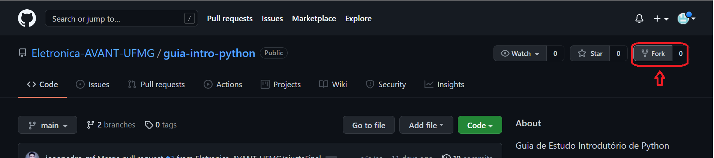
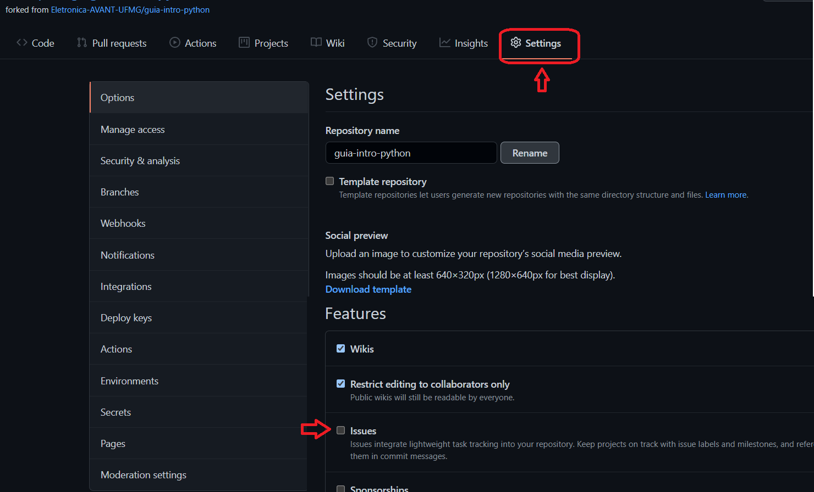
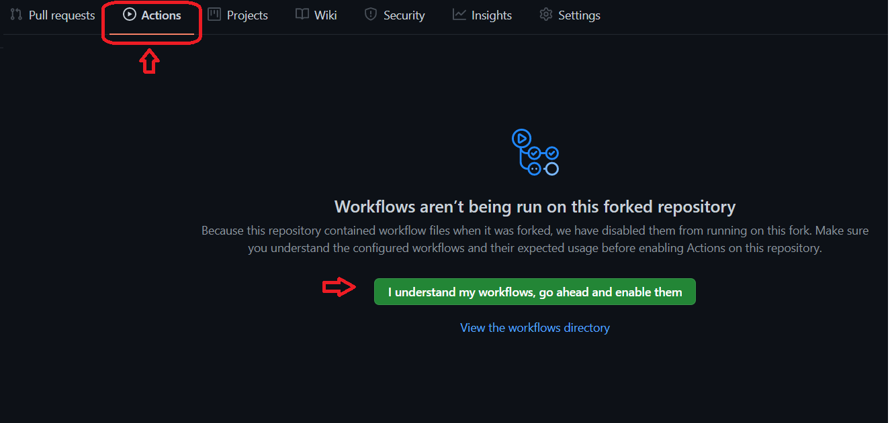
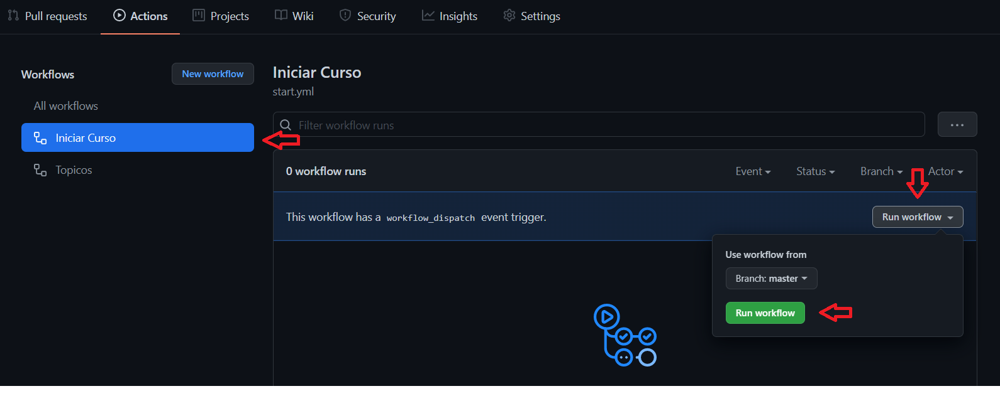

# Guia de Estudos de Python - Básico

Bem-vindo ao guia de estudos de introdução à Pyhton da Avant! Neste guia serão abordados os conceitos básicos de Python para as atividades dentro da equipe.

Vale ressaltar que este é um guia introdutório, com foco para quem está iniciando com a programação,
mas também pode ser usado para quem já possui experiência com Python e deseja relembrar alguns conceitos.

Neste guia você verá:

1. Booleanos e Condicionais
1. Listas
1. Tuplas
1. Strings e Dicionários
1. Bibliotecas
1. Arquivos

## Dinâmica do guia

Este guia tem como proposta apresentar os principais conceitos básicos de Python, através de links já disponíveis na internet, sendo eles artigos, livros e notebooks. A ideia é não ser um curso, visto que já existe bastante conteúdo gratuito disponível atualmente, mas orientar para o entendimento básico da linguagem.

O guia está dividido em módulos, que irão tratar de tópicos essenciais para o desenvolvimento e entendimento de aplicações envolvendo Python. Cada tópico será composto por um conjunto de links que irão abordar sobre o tema e ao final será proposto alguns desafios para fixação do conteúdo.

O guia se dará dentro da plataforma do GitHub, onde cada módulo será representado por uma Issue dentro do repositório onde você realizará o guia. Siga as instruções dentro da cada Issue para ir avançando no guia.

---

### Referências do guia

- [Lambda School](https://github.com/LambdaSchool/Intro-Python-I)
- [Kaggle guia Python](https://www.kaggle.com/learn/python)
- [Caderno Data Science](https://josenaldo.github.io/caderno-data-science/guia-python.html)
- [Livro - Pense em Python](https://penseallen.github.io/PensePython2e/)
- [guia Aprendendo a Programar com Python - Por: Luis Felipe de Araujo Zeni](http://luiszeni.com.br/python_classes/)

---

## Vamos começar!

Siga os passos abaixo para iniciar o curso:

### 1. **Faça o Fork do projeto atual**

Fork este projeto para seu repositório para conseguir iniciar o curso

### 2. **Configure o projeto para aceitar Issues**

O curso precisará criar Issues para criar os tópicos. Para isso deve ser necessário ativar as Issues.

- Dentro do repositório, entre em *Settings*
- Ative o campo de Issues

  

### 3. **Inicie o curso no Github Actions**

Agora é necessário ativar Ações dentro do Github para o andamento do curso.

- Entre no menu *Actions* e aceite a opção de uso de actions

  

- Após aceitar, será carregado todos ações configuradas para este guia. Entre no tópico "Iniciar Curso", clique em "_Run Worlflow_" e confirme.

  

  **Nota** : Durante o guia não será necessário entrar na Actions novamente, pois o progresso do curso será feito de forma automática.

### 4. **Vamos começar**

Pronto, você esta com tudo configurado aqui no Github para iniciar o curso!!

Entre na [*Issue Criada*](/../../issues/1), e siga as instruções para proseguir no curso.
